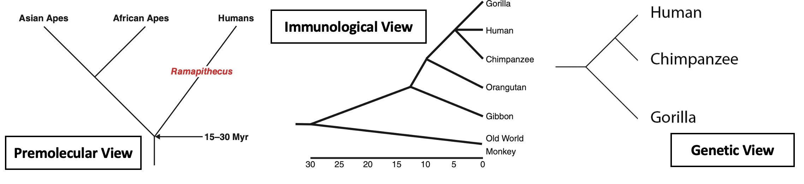

# Using Phylogenomic Data to Resolve the Hominoid Trichotomy

Abstract: The “hominoid trichotomy” is a classic issue in primate molecular systematics in which
the evolutionary relationships between humans, chimpanzees, and gorillas remain unresolved,
resulting in a polytomy at their ancestral node. Historically, immunological
studies succeeded in identifying chimpanzees and gorillas as our closest living relatives 
([Sarich and Wilson 1967](https://www.science.org/doi/10.1126/science.158.3805.1200?url_ver=Z39.88-2003&rfr_id=ori:rid:crossref.org&rfr_dat=cr_pub%20%200pubmed)). However, these early molecular studies using protein similarities failed to recognize a Chimp-Human, Gorilla-Human, or Gorilla-Chimp clade. With the advent of moonshot DNA sequencing projects, it was revealed that humans share greater overall sequence similarity with chimpanzees over gorillas. However, this similarity varies across the genome with some chromosomes diverging less with chimpanzees, while remaining near the expected values for gorillas ([Patterson et al. 2006](https://www.nature.com/articles/nature04789)). This project will employ publicly available  orthologous gene datasets from the National Center for Biotechnology Information (NCBI) and will utilize an updated suite of bioinformatics tools to reexamine the hominoid trichotomy. This project will build different trees based of orthologous genomic segments for great apes (homininae) with orangutans (Pongo) as an outgroup.


Figure 1. Historical development of hominid (great ape) systematics, figure adapted from Stoneking 2017

#### Outline

* [1. Downloading NCBI Gene Data](#section-1-Downloading-NCBI-Gene-Data)
* [2. NCBI Datasets Command Line Tools](#section-2-NCBI-Datasets-Command-Line-Tools)
* [3. MAFFT Alignment](#section-3-MAFFT-Alignment)
* [4. RAXML-NG Analysis](#section-4-RAXML-NG-Analysis)

## Section 1: Downloading NCBI Gene Data

#### NCBI Gene Database: https://www.ncbi.nlm.nih.gov/gene

#### All downloaded metadata and gene sequence files are found in the github repository under Gene_Lists/ and NCBI_Data/, respectively

* The NCBI Gene database contains gene sequences, transcripts, protein sequences. For the purposes of this project, I used gene sequences and orthologous gene information across the great apes

* I used online NCBI Gene Database web browser to download a .tsv file of all avaliable genes on Chromosome 12 for each taxon (Chimpanzees, Gorillas, Orangutans, Humans)

* I used a custom script (gene_list_clipper.py) to trim the metadata to only one relevant column (GeneID) for later use in this workflow
    1. Make sure that this script is in the same directory as the original NCBI Gene .txt file
    2. Add executable permissions using ```chmod +x ./gene_list_clipper.py```
    3. Run the script: ```./gene_list_clipper.py pongo_ch12_gene_list.txt gene_list.txt --rows 7```
    4. The ```--rows``` argument can be changed in accordance with how powerful the workstation one is working with

* While I initally attempted to download 50 genes, I lowered this value down to n = 7 for easier test analyses done on my personal workstation

#### NCBI Gene Information for *Pongo pygmaeus*

| **Tax ID** | **Organism Name** | **Gene ID** | **Current ID** | **Status** | **Symbol** | **Aliases** | **Description** | **Other Designations** | **Map Location** | **Chromosome** | **Genomic Nucleotide Accession.Version** | **Start Position** | **End Position** | **Orientation** | **Exon Count** | **OMIM** |
|------------|-------------------|-------------|----------------|------------|------------|-------------|-----------------|-------------------------|------------------|----------------|------------------------------------------|--------------------|------------------|----------------|----------------|----------|
| 9600       | *Pongo pygmaeus*  | 129030444   | 0              | live       | CD8A       |             | CD8 subunit alpha | T-cell surface glycoprotein CD8 alpha chain, CD8 alpha chain, Popy-CD8alpha, T-lymphocyte differentiation antigen T8/Leu-2 | 12               | NC_072385.2      | 46436479       | 46443580        | plus          | 6              |          |


## Section 2: NCBI Datasets Command Line Tools

##### Link to NCBI Command Line Tools installation and documentation: https://www.ncbi.nlm.nih.gov/datasets/docs/v2/download-and-install/

* This tool allows you to directly download gene information in large quantities, according to various parameters 

Figure 2. Schematic of NCBI Datasets operation

* Importantly, this tool also allows you to download orthologous genes according to a specified taxonomic group

* These orthologs are calculated using protein sequence similarity and synteny between an annotated genome and its reference genome. More information on NCBI's orthology assignment pipeline can be found here: https://www.ncbi.nlm.nih.gov/kis/info/how-are-orthologs-calculated/

* I used a loop to download each set of orthologous genes into one .fna file using the shortened gene list created from the gene_list_clipper.py script

``cat gene_list.txt | while read GENE; do
	datasets download gene gene-id "${GENE}"  --ortholog hominidae  --include gene --filename "${GENE}".zip
done``

* These are the arguments used in this command to download this dataset
```gene-id``` uses the gene name at the current iteration
```--ortholog``` downloads all orthologs according to a certain taxonomic group (hominidae)
```--include``` specifies what data should be downloaded (in this case gene sequences)
```--filename``` creates a .zip file with the name of the geneID at that iteration

* These zipped folders are then unzipped using the following command

``for file in *.zip; do unzip "$file" -d "${file%.zip}"; done
    rm *.zip``


## Section 3: MAFFT Alignment

* I used MAFTT (https://mafft.cbrc.jp/alignment/software/) to align orthologous gene sequences across all taxa

* I conducted each alignment in the directory of a given gene (NCBI_Data/########) and placed the alignment as ######_alignment.fnp in phylogenetic_analysis/

``mafft --auto --thread 4 gene.fna > phylogenetic_analysis/####_alignment``

* To correct for duplicate sequences and incorrect header format for later phylogenetic analyses, I wrote a custom script (process_fna.py) to clean the alignment files

    1. Make sure process_fna.py is in the phylogenetic_analysis folder
    2. Add executable permissions using ```chmod +x ./process_fna.py```
    3. Run this loop to process all files:
    ``  for file in *alignment; do
            ./process_fna.py "$file" "${file%.alignment}_alnp.fna"
        done``

#### NOTE: I removed duplicate samples and any multiple species within genera (i.e. removed multiple human sequences or removed *Pongo pygmaeus* if *Pongo abelii* is present), I did not realize there is likely issues later in the pipeline due to removing samples AFTER alignment. Upon viewing the alignments from these pruned datasets, it is obvious that large portions of a sequence are not present at the beginning positions. Further iterations of the project will rectify this conceptual error by performing data wrangling BEFORE sequence alignment. 


Figure 3. Noted error in my workflow. After pruning multiple taxa from an alignment file, I later noted that some alignments had blanks spaces up to 141 bp from the first position.

## Section 4: RAXML NG Analysis

* Finally, I conducted a phylogenetic analysis in RAXML-NG with each group of aligned orthologous genes

* I used a GTR+G nucleotide substitution model (```--model GTR+G```) for this analysis

* I conducted the analysis using a for loop across all alignments:

``for alnp in *.fna
do
    base=$(basename "$alnp" .fna)
    mkdir "$base"
    ./raxml-ng --all \
             --msa "$alnp" \
             --model GTR+G \
             --prefix "$base"/"$base" \
             --threads 4 \
             --bs-trees 100
done``

* Finally, I used FigTree to visualize best trees from RAXML. Ultimately 6 of the observed genes recovered the traditional hominid topology with Chimpanzees and Humans forming a monophyletic clade. Interestingly, one gene (CD8A) of the seven recovered a Gorilla-Human clade

* CD8A codes for an antigen on immune cells. While this project is limited in scope and inference on gene ontology, further phylogenomic analysis on functional sequences may elucidate conserved genetic elements found in deep time. Population-level analyses on human genetic variation indicates that many conserved functional variants shared between archaic humans (i.e. Neandertals and Denisovans) are located in coding regions related to immune function ([Almarri et al. 2020](https://www.cell.com/cell/fulltext/S0092-8674(20)30619-X?_returnURL=https%3A%2F%2Flinkinghub.elsevier.com%2Fretrieve%2Fpii%2FS009286742030619X%3Fshowall%3Dtrue)). 


Figure 4. CD8A and GMCL1 Gene Tree for Hominoidea. The majority of the analyzed genes in this project recovered a traditional Chimp-Human clade. One tree (CD8A) recovered a unique topology where Gorillas and Humans form a clade.
